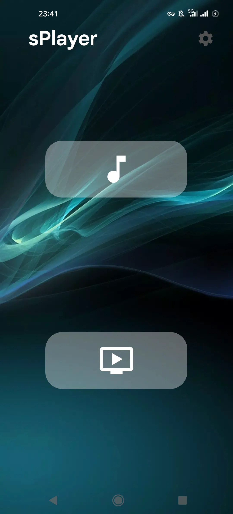
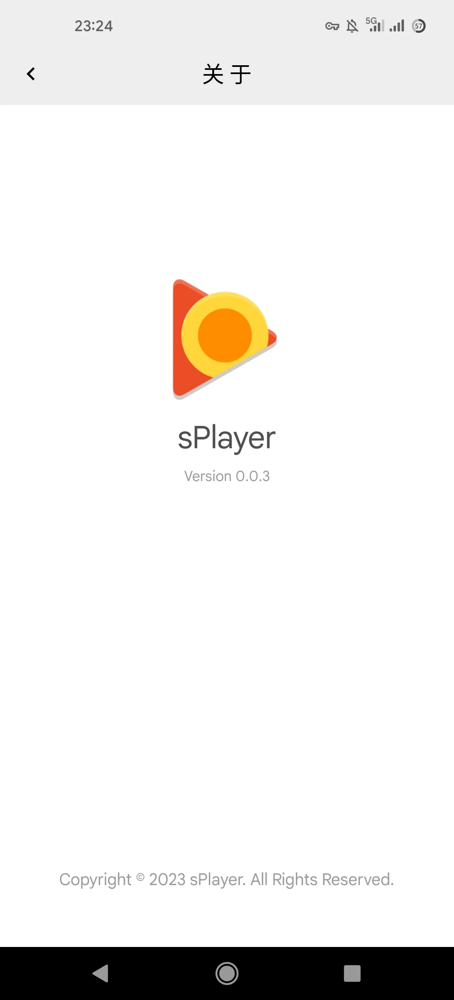
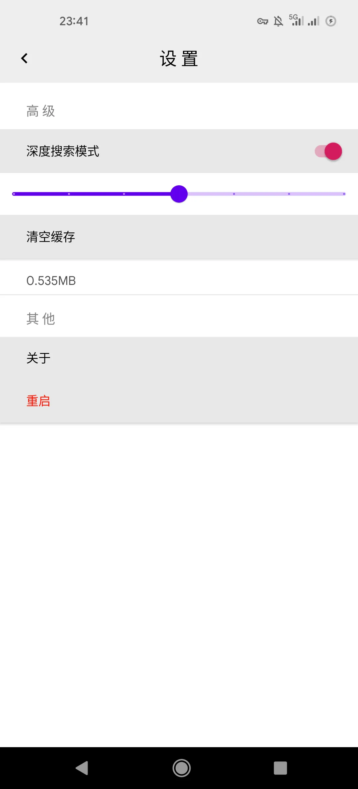
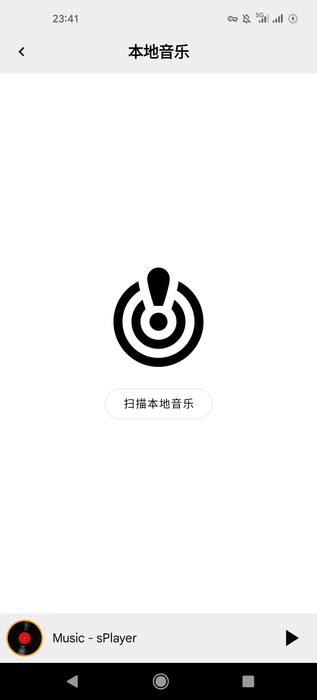
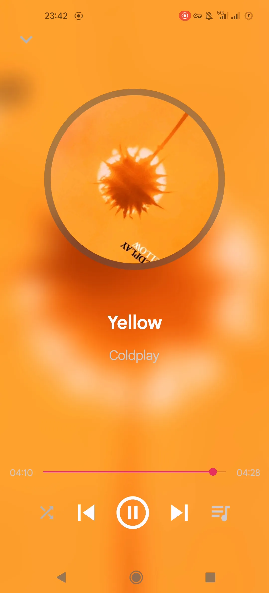

## sPlayer

  

sPlayer - A Simple Media Player for Android

---
## :sparkles: Features 

- Developed with full native Android SDK

- Android version: `7.0` - `13`

- Scan local media files
  - `Deep search` mode（`Native C`, with `JNI`）
    - Set search depth for folders: 1-7
  - `MediaStore` mode（ `Android API`）
  - Cache scan results
  - Cache wipe support
  - Save configuration of settings

- Audio Player Control
  - `Play`&`Pause`
  - `Next`&`Previous`
  - `Seekbar`
  - `Shuffle/Repeat/Loop`

- Format Support

| Type  | Formats |
|-------|---------|
| Audio | aac, ac3, ape, mp3, m4a, flac, oga, wav, weba, 3gp |
| Video | avi, flv, mkv, mp4, m2ts, flv, rmvb, ts, wav, webm, 3gp |

## :eyes: Demo 

<table>
    <tr>
      <th colspan="5" style="text-align:center;">ScreenShots</th>
    </tr>
    <tr>
        <td></td>
        <td></td>
        <td></td>
        <td></td>
        <td></td>
    </tr>
</table>

    <table style="margin: 0 auto;">
        <tr>
            <th colspan="1" style="text-align:center;">ScreenRecord</th>
        </tr>
        <tr>
            <td></td>
        </tr>
    </table>

## :hammer: Build 

 - Clone this repo
 - Import into Android Studio
 - Build and run

## :smile: Try this Demo 

 - Download the `APK` file
   - [Release](https://github.com/Albresky/sPlayer/releases/tag/v0.0.4)
 - Enjoy

## :speech_balloon: About 

The logo of this application is downloaded from the internet, if there is any infringement, please reach out to author.